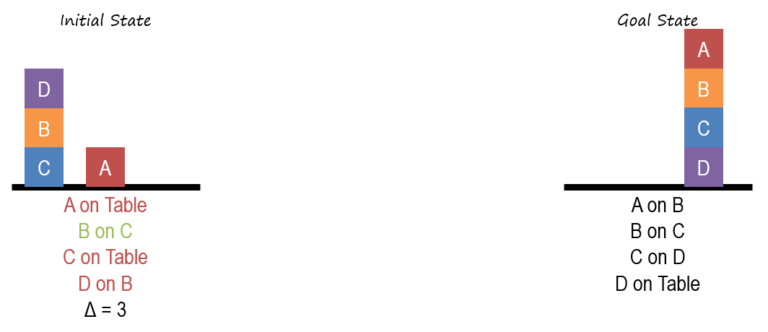

# Block World Problem

The block world problem is one of the most famous planning domains in artificial intelligence. The goal is to build one or more vertical stacks of blocks, turn the initial state into the goal state. Only one block may be moved at a time, it may be placed either on the table or on top of another block. A block may not be moved if there is another block on top of it. 

## Block World Agent 

This Python project implements an agent that can solve Block World problems optimally(in the minimum number of moves) for an arbitrary initial arrangement of blocks (A-Z, 26 blocks maximum). The technique behind the agent is: first use **Generate & Test** to generate a possible state, then use **Means-Ends Analysis** to choose the best state to move to.

The agent was designed to always try firstly moving the top block of the left stack
to the right stack, followed by checking if the difference has been reduced. If it
is, then this is the optimal move. If not, move the top block to the table, skip if a
block is already on the table alone, then use this state as the new state. The agent
will keep this operation for each block of the left stack until the difference reaches
zero, which means it has reached the goal state. Such method could ensure the
optimal moves have always been chosen

## How to Run

python3.8 main.py

An initial arrangement of blocks and a goal arrangement of blocks will be given, the agent will return a list of moves that will transform the initial state into the goal state. Each move should be a 2-tuple. The first item in each 2-tuple should be what block is being moved, and the second item should be where it is being moved to—either the name of another block or “Table” if it is to be put into a new pile.

For example, imagine the following initial and target state:

Initial: [["A", "B", "C"], ["D", "E"]]
Goal: [["A", "C"], ["D", "E", "B"]]

The goal here is to move Block B from the middle of the pile on the left and onto the top of the pile on the right. Hence this sequence of moves would be an acceptable solution:

[("C", "Table"), ("B", "E"), ("C", "A")]

